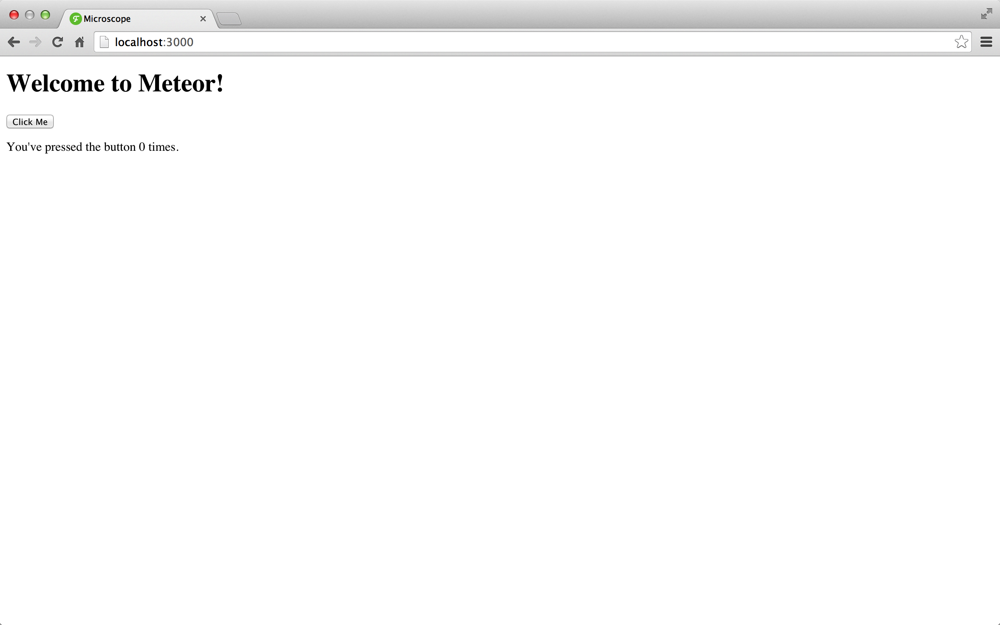

## [METEOR学习笔记](http://zh.discovermeteor.com/chapters/getting-started/)

+   [quickstart-Full API](http://docs.meteor.com/#/full/resources)

### 开始

首先，如果在 Mac OS 或 Linux 系统下，你可以打开终端窗口，输入以下命令来安装 Meteor：
>$ curl https://install.meteor.com | sh

如果你使用 Windows 系统，请参考 Meteor 网站的 [安装指导](https://www.meteor.com/install)。

*   [学习创建一个简单的应用](http://zh.discovermeteor.com/chapters/getting-started/)

安装好 Meteor 之后，我们来创建一个应用。创建应用要使用 Meteor 的命令行工具 meteor：
>$ meteor create projectName

要运行应用，请切换到终端，输入下面的命令：
>$ cd microscope
>$ meteor

现在打开浏览器，访问 http://localhost:3000（或者等效的 http://0.0.0.0:3000），应该能看到下面的网页：

**添加代码包**

bootstrap 代码包由 twbs 用户维护，所以该代码包的全名为 twbs:bootstrap。

另一方面，underscore 代码包依然算作 Meteor “官方”的代码包，所以这个包没有作者：

>meteor add twbs:bootstrap
>meteor add underscore

